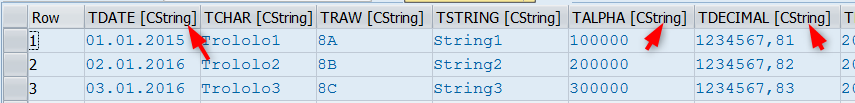

My first article on this topic was quite a while ago - [Abap tab-delimited text parser](/blog/tab-delimited-text-parser) - Since then I added some improvements to the project.

## Serializer - new feature

The main new feature is serializing. `ZCL_TEXT2TAB_SERIALIZER` class supports serialization of flat tables and structures. Here is how it works:

<!-- truncate -->

```abap
data lo_serializer type ref to zcl_text2tab_serializer.

lo_serializer = zcl_text2tab_serializer=>create(
  " the below params are all optional and have defaults inside
  i_decimal_sep = ','
  i_date_format = 'DMY.'
  i_max_frac_digits = 5 " For floats only ! not for decimals
  i_use_lf = abap_true " to use LF as line-break (not CRLF)
).

data lv_string type string.
lv_string = lo_serializer->serialize( lt_some_table ).
```

The produced result would be something like:

```text
NAME BIRTHDATE
ALEX 01.01.1990
JOHN 02.02.1995
LARA 03.03.2000
```

As can be seen from the code you can parametrize the date and amount formatting. E.g. for dates you can define the order of day, month and year and the separator symbol (the 4th char of the parameter)

## The parser improvements

The parser itself got some improvements

- Support for LF line breaks. Before just CRLF was supported, and now it is auto-detected
- Support for double quotes around the field value (removed during the parsing)
- Support for specifying the date format - same logic like in serializer (e.g. `DMY.` would expect dates like `01.09.2018`)

### Type-less parsing

The most noticeable change is type-less parsing. The parsed data is not validated against any specific structure. Instead it just reads the header line and dynamically creates the line structure out of it where each field is string and parsed without additional conversion. For example:

```abap
data:
  lr_data   type ref to data,
  lt_fields type string_table.

zcl_text2tab_parser=>create_typeless( )->parse( 
  exporting 
    i_data      = my_get_some_raw_text_data( )
  importing 
    e_head_fields = lt_fields  " Contain the list of field names
    e_container   = lr_data ). " The container is created inside the parser
```



The `e_container` will receive the data ref to the parsed table. For the data example in paragraph 1 the line type would contain respectively 2 fields: `NAME` and `BIRTHDATE` of string type each. The table can be e.g. passed to SALV.

## Technical changes

In the previous version the code lived in local classes in includes. Now the classes are global and also changed their names. The product is now called **TEXT2TAB** and not *DATA_PARSER*. Well, that's because is not some abstract 'data' actually but tab-delimited text processor ... and also it is not only the 'parser' anymore ...

The code is open sourced and can be found in this [github repository](https://github.com/sbcgua/text2tab).

The best way to install the tool would be [abapGit](https://github.com/abapGit/abapGit) - this is an amazing developer tool, if you haven't tried it yet, you really should.

P.S. *Originally posted at [SAP Community platform](https://community.sap.com/t5/application-development-and-automation-blog-posts/text2tab-tab-delimited-text-parser-and-now-also-serializer/ba-p/13365819) on 2016-Aug-28*
